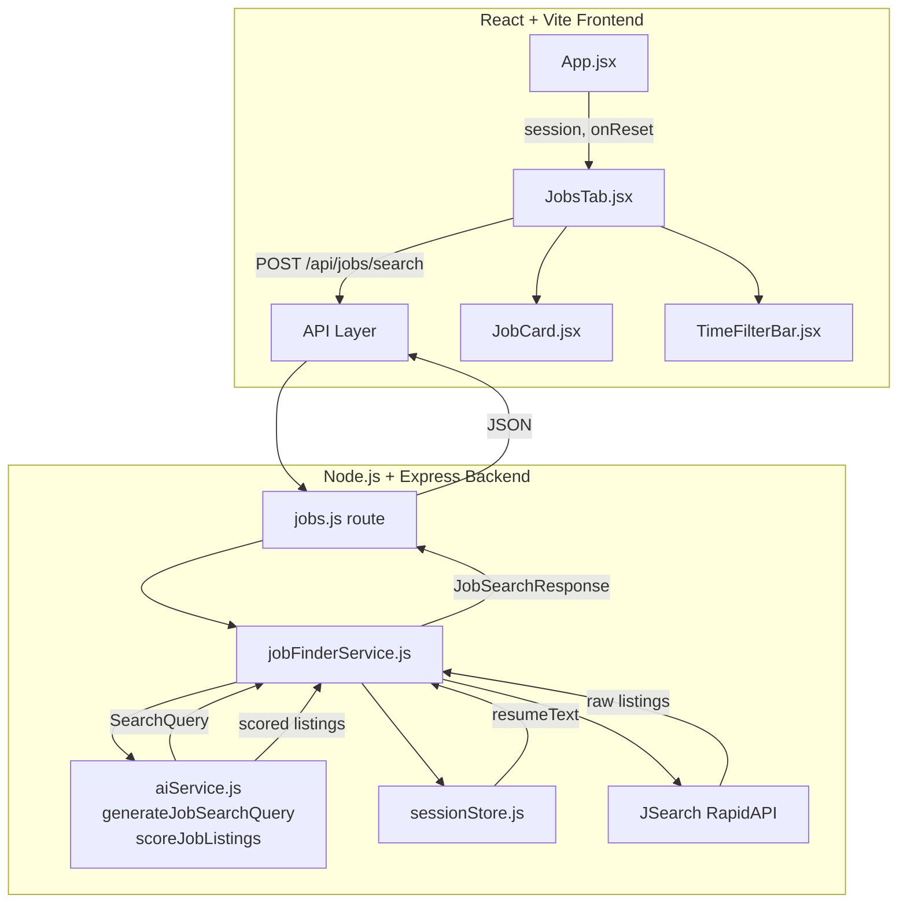

# Design Document: AI Resume Analysis + Job Finder

## Overview

This feature extends the existing Job Assistant application with an AI-powered job discovery workflow. After a user uploads their resume, the system uses the existing LangChain/Gemini AI pipeline to extract a structured search profile from the resume, queries the JSearch API (via RapidAPI) for real job listings, scores each listing for relevance against the resume, and presents the ranked results in a new "Jobs" tab alongside the existing Analysis, Resume, Cover Letter, Interview, and Skills Gap tabs.

The design follows the existing patterns in the codebase: a new Express route (`/api/jobs/search`), a new service (`jobFinderService.js`), a new AI function added to `aiService.js`, and a new React tab component (`JobsTab.jsx`). No new infrastructure is required — the feature plugs into the existing session store, multer upload middleware, and LangChain model instances.

### Key Design Decisions

- **JSearch via RapidAPI** is chosen as the job board API because it aggregates LinkedIn, Indeed, Glassdoor, and others in a single endpoint, requires no employer partnership, and has a free tier suitable for development.
- **AI relevance scoring** is done in a single batched Gemini call (all listings at once) rather than one call per listing, to stay within the 20-second budget for up to 20 listings.
- **Fallback query generation** uses a simple regex extraction of the most recent job title from the resume text when the AI call fails, ensuring the feature degrades gracefully.
- **Frontend state** for jobs is managed locally in `JobsTab.jsx` using `useState`/`useEffect`, consistent with how other tabs receive data via props from `App.jsx`.

---

## Architecture



### Request Flow

1. User uploads resume → `sessionStore` stores `resumeText` under `sessionId`
2. User opens Jobs tab → `JobsTab` mounts, triggers `POST /api/jobs/search` with `{ sessionId, timeFilter: "7d" }`
3. Route handler validates inputs, calls `jobFinderService.search(sessionId, timeFilter)`
4. `jobFinderService` reads `resumeText` from `sessionStore`
5. `aiService.generateJobSearchQuery(resumeText)` → `{ jobTitle, skills, location }`
6. `jobFinderService` calls JSearch API with the query + time filter
7. Raw listings are filtered (remove entries without `applyUrl`), capped at 20
8. `aiService.scoreJobListings(listings, resumeText)` → listings with `relevanceScore`, `isHighMatch`, `scoredOnTitleOnly`
9. Listings sorted descending by `relevanceScore`, returned as `{ jobs, query, totalCount }`
10. `JobsTab` renders job cards with filter controls and Apply buttons

---

## Components and Interfaces

### Backend Components

#### `src/routes/jobs.js` (new)
Express router mounted at `/api/jobs`. Handles input validation, delegates to `jobFinderService`, and returns structured JSON. Follows the same pattern as `analysis.js`.

#### `src/services/jobFinderService.js` (new)
Orchestrates the full job search pipeline: reads session, calls AI for query generation, calls JSearch API, filters/maps results, calls AI for scoring, sorts and returns. Contains all business logic for the jobs feature.

#### `src/services/aiService.js` (extended)
Two new functions added:
- `generateJobSearchQuery(resumeText)` — extracts `{ jobTitle, skills[], location }` from resume text
- `scoreJobListings(listings, resumeText)` — returns each listing annotated with `relevanceScore`, `isHighMatch`, `scoredOnTitleOnly`

#### `src/config/index.js` (extended)
Add `rapidApiKey: process.env.RAPIDAPI_KEY` to the config object.

### Frontend Components

#### `src/components/tabs/JobsTab.jsx` (new)
Top-level tab component. Manages local state: `jobs`, `query`, `loading`, `error`, `timeFilter`. Triggers search on mount and on filter change. Renders `TimeFilterBar`, a list of `JobCard` components, and empty/error states.

#### `src/components/JobCard.jsx` (new)
Presentational component for a single job listing. Displays title, company, location, posted date (human-readable), relevance score badge, snippet, and Apply button. Highlights high-match listings with a distinct border/badge.

#### `src/components/TimeFilterBar.jsx` (new)
Three-button filter control. Accepts `activeFilter`, `onChange`, and `disabled` props. Renders "Last 24 Hours", "Last 2 Days", "Last 7 Days" buttons with active state styling.

#### `src/App.jsx` (modified)
- Add `"jobs"` to the `TABS` array with label `"🔍 Find Jobs"`
- Import and render `JobsTab` in the tab content section
- Pass `session` and `onReset` (already available) to `JobsTab`
- Show the Jobs tab whenever a session exists (no analysis required — job search only needs the resume)

---

## Data Models

TypeScript-style interfaces for the key data structures:

```typescript
// The structured search query extracted from the resume by AI
interface SearchQuery {
  jobTitle: string;           // e.g., "Senior Software Engineer"
  skills: string[];           // max 5 items, e.g., ["React", "Node.js", "TypeScript"]
  location?: string;          // optional, e.g., "San Francisco, CA" or "Remote"
}

// A single job listing as returned by the backend to the frontend
interface JobListing {
  id: string;                 // unique identifier (from JSearch job_id)
  title: string;              // job title
  company: string;            // employer name
  location: string;           // city/state or "Remote"
  snippet: string;            // job description excerpt, max 300 chars
  applyUrl: string;           // direct link to application page (required, non-empty)
  postedAt: string;           // ISO 8601 date string, e.g., "2025-01-15T10:30:00Z"
  source: string;             // originating job board, e.g., "LinkedIn", "Indeed"
  relevanceScore: number;     // 0–100, AI-computed match score
  isHighMatch: boolean;       // true when relevanceScore >= 70
  scoredOnTitleOnly: boolean; // true when snippet was empty during scoring
}

// The full response from POST /api/jobs/search
interface JobSearchResponse {
  jobs: JobListing[];         // sorted descending by relevanceScore, max 20
  query: SearchQuery;         // the AI-generated query used for this search
  totalCount: number;         // number of jobs in the array
}

// The resume profile stored in the session (existing + extended)
interface SessionData {
  resumeText: string;         // full extracted PDF text (existing)
  fileName: string;           // original filename (existing)
  pageCount: number;          // PDF page count (existing)
  analysis?: object;          // match analysis result (existing)
  jobDescription?: string;    // last used job description (existing)
  // No new fields needed — jobFinderService reads resumeText directly
}

// Request body for POST /api/jobs/search
interface JobSearchRequest {
  sessionId: string;          // required, must match active session
  timeFilter: "24h" | "2d" | "7d"; // required
}
```

### JSearch API Mapping

The JSearch API (RapidAPI) returns job objects with the following relevant fields that map to `JobListing`:

```javascript
// JSearch raw result → JobListing mapping
{
  job_id          → id
  job_title       → title
  employer_name   → company
  job_city + job_state + job_country → location (concatenated)
  job_description → snippet (truncated to 300 chars)
  job_apply_link  → applyUrl (excluded if null/empty)
  job_posted_at_datetime_utc → postedAt
  job_publisher   → source
}
```

### Time Filter to JSearch Parameter Mapping

```javascript
const TIME_FILTER_MAP = {
  "24h": "today",    // JSearch: date_posted=today
  "2d":  "3days",    // JSearch: date_posted=3days (closest available)
  "7d":  "week",     // JSearch: date_posted=week
};
```

---

## External API Integration: JSearch via RapidAPI

### Endpoint

```
POST https://jsearch.p.rapidapi.com/search
```

### Request Headers

```javascript
{
  "X-RapidAPI-Key": process.env.RAPIDAPI_KEY,
  "X-RapidAPI-Host": "jsearch.p.rapidapi.com"
}
```

### Request Parameters

```javascript
// GET /search?query=...&num_pages=1&date_posted=week
{
  query: `${jobTitle} ${skills.slice(0, 2).join(" ")}`,  // e.g., "Software Engineer React Node.js"
  num_pages: "1",       // returns ~10 results per page; we request 2 pages for up to 20
  date_posted: "week",  // mapped from timeFilter
  remote_jobs_only: "false",
  employment_types: "FULLTIME"
}
```

### Example Response (abbreviated)

```json
{
  "status": "OK",
  "data": [
    {
      "job_id": "abc123",
      "job_title": "Senior Software Engineer",
      "employer_name": "Acme Corp",
      "job_city": "San Francisco",
      "job_state": "CA",
      "job_country": "US",
      "job_description": "We are looking for a Senior Software Engineer...",
      "job_apply_link": "https://jobs.acme.com/apply/abc123",
      "job_posted_at_datetime_utc": "2025-01-15T10:30:00.000Z",
      "job_publisher": "LinkedIn"
    }
  ]
}
```

### Error Response Handling

| HTTP Status | Meaning | jobFinderService behavior |
|---|---|---|
| 200 with `status: "OK"` | Success | Map and return listings |
| 200 with `status: "ERROR"` | API-level error | Return structured error, empty array |
| 401 | Invalid API key | Return structured error, log key hint |
| 429 | Rate limit exceeded | Return structured error with retry hint |
| 5xx | Server error | Return structured error, empty array |
| Timeout (>15s) | Network timeout | Return structured error, empty array |

---

## Error Handling Strategy

### Backend Error Hierarchy

```
POST /api/jobs/search
├── 400 Bad Request
│   ├── Missing sessionId
│   ├── Missing timeFilter
│   └── Invalid timeFilter value (not "24h", "2d", "7d")
├── 404 Not Found
│   └── sessionId not in sessionStore (or session has no resumeText)
├── 500 Internal Server Error (structured, never raw)
│   ├── AI query generation failure → fallback to regex extraction
│   ├── JSearch API error → { jobs: [], query: fallbackQuery, totalCount: 0, error: "..." }
│   └── AI scoring failure → return unscored listings with relevanceScore: 0
```

### Fallback Chain

```
AI query generation
  ↓ (on failure)
Regex extraction: find last "Job Title:" or most recent capitalized noun phrase
  ↓ (on failure)
Use filename as query (e.g., "john_doe_resume.pdf" → "john doe")
```

### Frontend Error States

The `JobsTab` component handles three distinct error states:

1. **Network/API error** — shows error message + "Try Again" button that re-triggers the search
2. **Zero results** — shows "No jobs found" message + suggestion to broaden search (no retry needed)
3. **Session expired** — shows "Please re-upload your resume" message (no retry, redirect to upload)

All error messages shown to users are sanitized — internal API error details, keys, and URLs are never exposed. The raw error is logged server-side only.

### Logging

`jobFinderService` logs all JSearch API errors with:
```javascript
console.error("[JobFinder] JSearch API error", {
  requestParams: { query, timeFilter, numPages },
  responseStatus: err.response?.status,
  responseMessage: err.response?.data?.message,
  timestamp: new Date().toISOString(),
});
```

---

## Correctness Properties

*A property is a characteristic or behavior that should hold true across all valid executions of a system — essentially, a formal statement about what the system should do. Properties serve as the bridge between human-readable specifications and machine-verifiable correctness guarantees.*

### Property 1: Search Query Schema Invariant

*For any* resume text of 50 or more characters, calling `generateJobSearchQuery()` SHALL return an object where `jobTitle` is a non-empty string, `skills` is an array of at most 5 strings, and `location` is either a string or undefined.

**Validates: Requirements 1.1, 1.2**

---

### Property 2: Short Resume Rejection

*For any* string with fewer than 50 characters, calling `generateJobSearchQuery()` SHALL return an error (throw or return an error object) and SHALL NOT return a valid `SearchQuery` object.

**Validates: Requirements 1.3**

---

### Property 3: Result Count Cap

*For any* JSearch API response containing N job listings (where N may be any non-negative integer), the output of `jobFinderService.search()` SHALL contain at most 20 `JobListing` objects.

**Validates: Requirements 2.2**

---

### Property 4: Job Listing Mapping Completeness

*For any* valid JSearch API response object, the mapping function SHALL produce a `JobListing` where all required fields (`id`, `title`, `company`, `location`, `snippet`, `applyUrl`, `postedAt`, `source`) are present and non-null.

**Validates: Requirements 2.3**

---

### Property 5: Invalid Apply URL Exclusion

*For any* array of raw job listings where some entries have a null, undefined, or empty `job_apply_link`, the filtered output SHALL contain only entries with a valid (non-empty string) `applyUrl`.

**Validates: Requirements 2.5**

---

### Property 6: Relevance Score Range

*For any* job listing and resume text passed to `scoreJobListings()`, every returned listing SHALL have a `relevanceScore` that is an integer in the range [0, 100] inclusive.

**Validates: Requirements 3.1**

---

### Property 7: Descending Sort Invariant

*For any* array of `JobListing` objects with arbitrary `relevanceScore` values, after applying the sort function, each element's `relevanceScore` SHALL be greater than or equal to the next element's `relevanceScore`.

**Validates: Requirements 3.2**

---

### Property 8: High Match Flag Consistency

*For any* `JobListing` object, `isHighMatch` SHALL be `true` if and only if `relevanceScore >= 70`.

**Validates: Requirements 3.4**

---

### Property 9: Title-Only Scoring Flag

*For any* job listing where `snippet` is an empty string or whitespace-only, the scored listing SHALL have `scoredOnTitleOnly` set to `true`. *For any* listing where `snippet` is non-empty, `scoredOnTitleOnly` SHALL be `false`.

**Validates: Requirements 3.5**

---

### Property 10: Invalid Session Returns 404

*For any* string used as `sessionId` that does not correspond to an active session in the store, `POST /api/jobs/search` SHALL return HTTP 404.

**Validates: Requirements 4.3**

---

### Property 11: Invalid Time Filter Returns 400

*For any* string that is not one of `"24h"`, `"2d"`, or `"7d"` used as `timeFilter`, `POST /api/jobs/search` SHALL return HTTP 400.

**Validates: Requirements 4.4**

---

### Property 12: Job Card Renders All Required Fields

*For any* `JobListing` object, the rendered `JobCard` component SHALL include the job title, company name, location, posted date, relevance score, snippet text, and an Apply button in its output.

**Validates: Requirements 5.1**

---

### Property 13: High Match Visual Distinction

*For any* `JobListing` with `isHighMatch: true`, the rendered `JobCard` SHALL include the high-match visual indicator (CSS class or "Top Match" badge). *For any* listing with `isHighMatch: false`, the indicator SHALL be absent.

**Validates: Requirements 5.3**

---

### Property 14: Filter Selection Triggers Correct API Call

*For any* valid `timeFilter` value (`"24h"`, `"2d"`, `"7d"`), when the user selects that filter in `TimeFilterBar`, the resulting API call SHALL include that exact `timeFilter` value in the request body.

**Validates: Requirements 6.2**

---

### Property 15: Active Filter Visual State

*For any* `timeFilter` value set as active in `TimeFilterBar`, the corresponding button SHALL have the selected visual state (active CSS class), and the other two buttons SHALL not have the selected state.

**Validates: Requirements 6.3**

---

### Property 16: Apply Link Security Attributes

*For any* `JobListing` rendered as a `JobCard`, the Apply link element SHALL have `rel="noopener noreferrer"` and `target="_blank"` attributes.

**Validates: Requirements 7.3**

---

### Property 17: AI Fallback on Query Generation Failure

*For any* resume text where the AI service throws an error during query generation, `jobFinderService.search()` SHALL still produce a `SearchQuery` object (via regex fallback) and SHALL NOT propagate the AI error as an unhandled exception.

**Validates: Requirements 9.2**

---

## Testing Strategy

### Dual Testing Approach

Unit tests cover specific examples, edge cases, and error conditions. Property-based tests verify universal invariants across generated inputs. Both are needed for comprehensive coverage.

### Property-Based Testing Library

**[fast-check](https://github.com/dubzzz/fast-check)** is the chosen PBT library for both backend (Node.js) and frontend (Vitest). It integrates cleanly with Jest/Vitest, supports async properties, and has excellent TypeScript support.

Install: `npm install --save-dev fast-check`

Each property test runs a minimum of **100 iterations**. Each test is tagged with a comment referencing the design property:

```javascript
// Feature: ai-resume-job-finder, Property 7: Descending Sort Invariant
it("sorts job listings by relevance score descending", () => {
  fc.assert(
    fc.property(
      fc.array(fc.record({ relevanceScore: fc.integer({ min: 0, max: 100 }) })),
      (listings) => {
        const sorted = sortByRelevance(listings);
        for (let i = 0; i < sorted.length - 1; i++) {
          expect(sorted[i].relevanceScore).toBeGreaterThanOrEqual(sorted[i + 1].relevanceScore);
        }
      }
    ),
    { numRuns: 100 }
  );
});
```

### Unit Test Focus Areas

- `generateJobSearchQuery`: valid resume → correct schema; short resume → error
- `mapJSearchResult`: raw API object → `JobListing` with all fields
- `filterInvalidListings`: mixed valid/invalid applyUrl → only valid remain
- `applyHighMatchFlag`: score ≥ 70 → `isHighMatch: true`; score < 70 → `false`
- `sortByRelevance`: unsorted array → descending order
- `JobCard` rendering: all fields present; high match badge; apply link attributes
- `TimeFilterBar`: active state; onChange callback

### Integration Test Focus Areas

- `POST /api/jobs/search` with valid inputs and mocked JSearch + AI → 200 with correct shape
- `POST /api/jobs/search` with missing/invalid fields → 400/404
- `jobFinderService` with mocked AI failure → fallback query used, no crash
- `jobFinderService` with mocked JSearch failure → structured error response
- End-to-end: upload resume → search jobs → verify response shape

### Property Tests by Component

| Property | Component | Generator |
|---|---|---|
| 1, 2 | `aiService.generateJobSearchQuery` | `fc.string()`, length-filtered |
| 3 | `jobFinderService` (cap logic) | `fc.array(jobListingArb, { maxLength: 50 })` |
| 4 | `mapJSearchResult` | `fc.record(jsearchResultArb)` |
| 5 | `filterInvalidListings` | `fc.array(fc.record({ applyUrl: fc.option(fc.string()) }))` |
| 6 | `aiService.scoreJobListings` (mocked) | `fc.record(jobListingArb)` |
| 7 | `sortByRelevance` | `fc.array(fc.record({ relevanceScore: fc.integer(0, 100) }))` |
| 8 | `applyHighMatchFlag` | `fc.integer({ min: 0, max: 100 })` |
| 9 | `scoreJobListings` (mocked) | `fc.record({ snippet: fc.oneof(fc.constant(""), fc.string()) })` |
| 10 | `POST /api/jobs/search` | `fc.string()` (non-existent session IDs) |
| 11 | `POST /api/jobs/search` | `fc.string().filter(s => !["24h","2d","7d"].includes(s))` |
| 12–13 | `JobCard` (React Testing Library) | `fc.record(jobListingArb)` |
| 14–15 | `TimeFilterBar` | `fc.constantFrom("24h", "2d", "7d")` |
| 16 | `JobCard` | `fc.record(jobListingArb)` |
| 17 | `jobFinderService` (AI mocked to throw) | `fc.string({ minLength: 50 })` |
